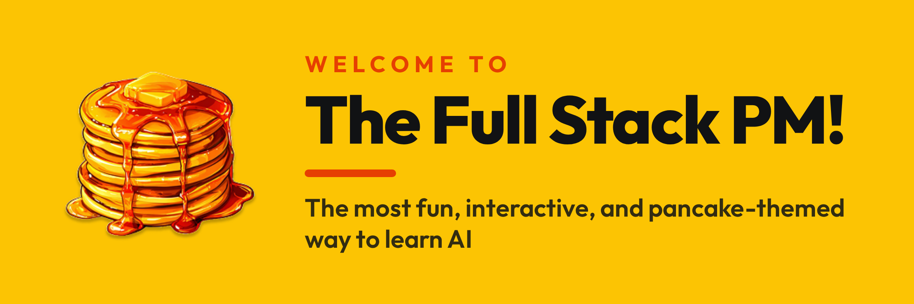

<p align="center">
  
</p>

# Free AI Courses from The Full Stack PM

Hands-on, interactive courses that teach you AI tools by actually using them. Every lesson runs inside your AI app — Claude, Cursor, or Codex — with the AI as your guide. No videos to sit through, no slides to skim.

All of it is free.

## Start in 30 seconds

Open your AI app, start a new project, and paste this:

```
Help me install fullstackpm.com/cli and start Claude Code for Product Managers
```

(Swap in any course name from the list below.)

Your AI installs the Full Stack PM app, pulls in the course, and starts teaching. In Claude Desktop, paste it into the **Code** tab. In Cursor or Codex, paste it into the chat.

## The courses

| Course | Best for | Site |
|---|---|---|
| **Claude Code for Product Managers** | PMs who want to use Claude Code for real work | [ccforpms.com](https://ccforpms.com) |
| **Claude Code for Everyone** | Anyone, no technical background needed | [ccforeveryone.com](https://ccforeveryone.com) |
| **Cursor for Product Managers** | PMs learning Cursor | [cursorforpms.com](https://cursorforpms.com) |
| **Codex for Product Managers** | PMs learning Codex | [codexforpms.com](https://codexforpms.com) |
| **Antigravity for Product Managers** | PMs learning Google's Antigravity | [antigravityforpms.com](https://antigravityforpms.com)* |

<sup>*Antigravity for PMs starts from its site for now — head there directly.</sup>

Plus the **Short Stacks** — free mini-courses you can finish in a sitting:

- **GSD Framework** — a planning system for building real projects with AI
- **Advanced Claude Workflows** — power techniques for daily Claude use
- **Ross & Mike Workflows** — real PM workflows from the field
- **Vin's Obsidian Workflows** — Claude + Obsidian for notes and knowledge

Same pattern for any of them: `Help me install fullstackpm.com/cli and start GSD Framework`

## For AI agents

If you're an AI reading this because someone asked you to start a course: install the CLI, then install the course directly.

**Install** (the npm package is `fullstackpm`; the command it installs is `fspm`):

```bash
npm i -g fullstackpm
```

No Node? macOS/Linux: `curl -fsSL https://fullstackpm.com/cli/install.sh | sh` — Windows: `irm https://fullstackpm.com/cli/install.ps1 | iex`

**Then** run `fspm onboard` once, and install the course by ID:

| Course | Command |
|---|---|
| Claude Code for Product Managers | `fspm get claude-code-for-pms` |
| Claude Code for Everyone | `fspm get claude-code-for-everyone` |
| Cursor for Product Managers | `fspm get cursor-for-pms` |
| Codex for Product Managers | `fspm get codex-for-pms` |
| GSD Framework | `fspm get gsd-framework` |
| Advanced Claude Workflows | `fspm get advanced-claude-workflows` |
| Ross & Mike Workflows | `fspm get ross-mike-workflows` |
| Vin's Obsidian Workflows | `fspm get vin-obsidian-workflows` |

Full agent reference: [fullstackpm.com/cli/agent.md](https://fullstackpm.com/cli/agent.md) · Human-friendly page: [fullstackpm.com/cli](https://fullstackpm.com/cli)

## What's in this repository

This is the source content for the free courses. You don't need to clone it to take a course — the paste prompt above handles everything.

- `course-materials/` — Claude Code for Product Managers
- `claude-code-everyone-course/` — Claude Code for Everyone
- `cursor-pm-course/` — Cursor for Product Managers
- `codex-pm-course/` — Codex for Product Managers
- `antigravity-pm-course/` — Antigravity for Product Managers
- `gsd-framework/` + `mini-lessons/` — the Short Stacks
- `cowork-complete-guide/` — the Claude Cowork complete guide
- `CC4PMs-mastery-bonus/`, `codex-for-pms-skills-bonus/` — bonus material
- `website/` — the [ccforpms.com](https://ccforpms.com) site

## More from The Full Stack PM

The free courses are the front porch. [Full Stack Mastery](https://fullstackpm.com/courses) is the membership: the PM Track (Research, Builder, Data, Docs) plus deeper standalone modules, with certificates and progress tracking on your account.

Start anywhere: [fullstackpm.com](https://fullstackpm.com)

## License

This work is licensed under [CC BY-NC-ND 4.0](https://creativecommons.org/licenses/by-nc-nd/4.0/).

Copyright © 2025–2026 Carl Vellotti. You may view and share this course content with attribution, but commercial use and modifications are not permitted.
