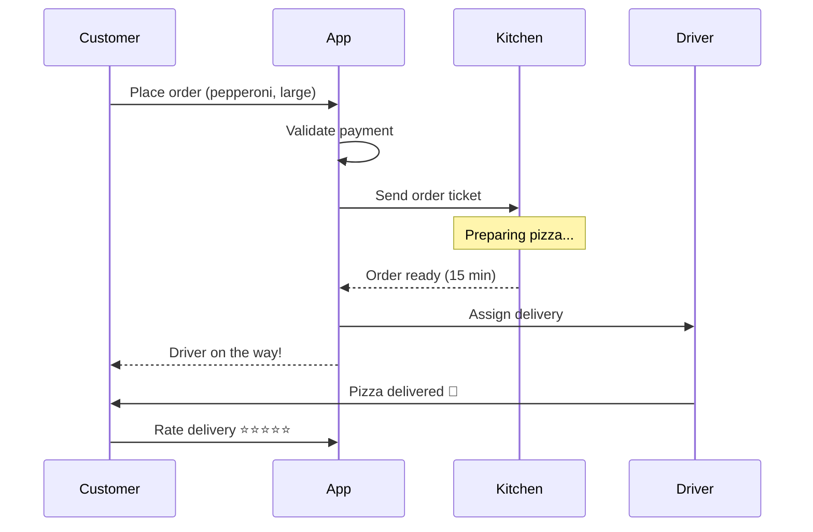

# Pizza Ordering Flow

This diagram shows how a pizza order flows through the system.

## Key Components

- **Customer**: Places and receives orders via the App
- **App**: Central hub that coordinates everything
- **Kitchen**: Receives tickets, prepares food, signals when ready
- **Driver**: Gets assigned deliveries, completes handoff

## Error Handling

- If payment fails: Customer sees error, order not created
- If kitchen is overloaded: App queues order, sends ETA to customer
- If driver unavailable: App reassigns or offers pickup option
